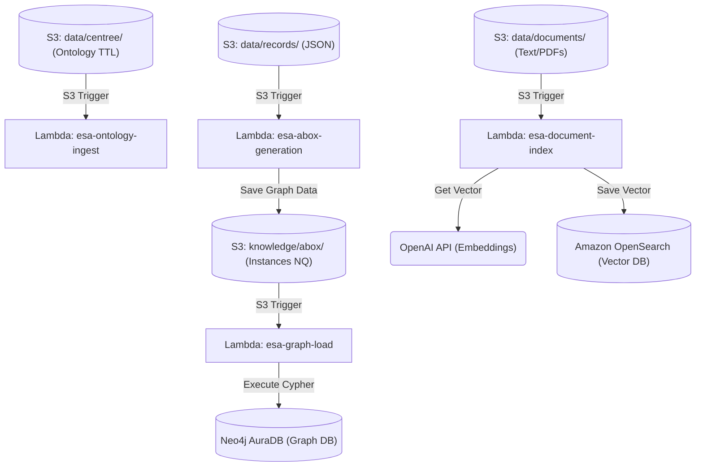

# AWS Serverless Pipeline Guide

This document explains the architecture of the serverless Enterprise Semantic Layer pipeline, what each AWS Lambda function does, and how to trigger the end-to-end process.

## 1. Architecture Overview

The pipeline consists of four AWS Lambda functions that are triggered automatically when files are uploaded to specific folders in your S3 bucket (`esa-poc-2026-useast1`).

### System Flow Diagram


### The Lambda Functions:

1. **`esa-ontology-ingest`**
   - **Triggered by:** Uploading `ontology.ttl` to `s3://esa-poc-2026-useast1/data/centree/`
   - **What it does:** Parses the raw Turtle ontology file and converts it into a standardized N-Quads format (`ontology.nq`), then saves it back to S3.

2. **`esa-abox-generation`**
   - **Triggered by:** Uploading JSON records to `s3://esa-poc-2026-useast1/data/records/`
   - **What it does:** Downloads the `customers.json`, `accounts.json`, and `loans.json` files. It performs entity resolution (deduplicating customers) and maps the JSON data against your ontology to create a knowledge graph. 
   - **Output:** Saves the graph data as `instances.nq` in S3 (`knowledge/abox/instances.nq`).

3. **`esa-graph-load`**
   - **Triggered by:** The creation of `instances.nq` in S3 (outputted by `esa-abox-generation`).
   - **What it does:** Downloads the `.nq` graph file and executes Cypher queries to load all the Nodes and Relationships (Customers, Accounts, Loans) directly into your **Neo4j AuraDB** cloud database.

4. **`esa-document-index`**
   - **Triggered by:** Uploading text documents to `s3://esa-poc-2026-useast1/data/documents/`
   - **What it does:** Reads the raw text policies/documents, chunks them into smaller pieces, generates vector embeddings using **OpenAI**, and stores them in your **Amazon OpenSearch** vector database for semantic search.

---

## 2. Order of Execution (Fully Automated!)

**IMPORTANT: You NEVER need to run or trigger the AWS Lambda functions manually.** 

AWS Lambda is "event-driven". This means the AWS Cloud is constantly watching your S3 bucket. As soon as you upload a file using the `aws s3 cp` commands below, AWS will instantly wake up the correct Lambda function and run it for you automatically.

Here is the exact chain reaction of what happens when you upload files:

1. **Upload `ontology.ttl`** -> Triggers `esa-ontology-ingest` (runs first and alone).
2. **Upload `documents/`** -> Triggers `esa-document-index` (runs independently).
3. **Upload `records/`** -> Triggers `esa-abox-generation` (runs first).
4. **When `esa-abox-generation` finishes** -> It saves `instances.nq` to S3, which automatically triggers `esa-graph-load` (runs last).

### Step 1: Upload the Ontology
Upload your structural rules (T-Box):
```cmd
aws s3 cp data\centree\ontology.ttl s3://esa-poc-2026-useast1/data/centree/ontology.ttl
```

### Step 2: Upload Unstructured Documents
Upload your text documents. This will automatically trigger `esa-document-index` to populate OpenSearch:
```cmd
aws s3 cp data\documents\ s3://esa-poc-2026-useast1/data/documents/ --recursive
```

### Step 3: Upload Structured Records
Upload your JSON data. This will automatically trigger `esa-abox-generation` to build the graph, which then automatically triggers `esa-graph-load` to push it to Neo4j AuraDB:
```cmd
aws s3 cp data\records\customers.json s3://esa-poc-2026-useast1/data/records/customers.json
aws s3 cp data\records\accounts.json s3://esa-poc-2026-useast1/data/records/accounts.json
aws s3 cp data\records\loans.json s3://esa-poc-2026-useast1/data/records/loans.json
```

*(Note: You can copy and paste all three lines at once in your terminal)*

---

## 3. Verifying the Results

Once you run the upload commands, wait about 15 to 30 seconds for all the Lambda functions to finish processing.

1. **Verify Graph Data:**
   - Log into your [Neo4j Aura Console](https://console.neo4j.io/).
   - Open your instance and run this query:
     ```cypher
     MATCH (n) RETURN n LIMIT 25;
     ```
   - You should see visual nodes for `Customer`, `Account`, and `Loan`.

2. **Verify Vector Data:**
   - Go to your Amazon OpenSearch dashboard.
   - Check the index count to ensure documents are being retrieved.

3. **Check Logs (Troubleshooting):**
   - If something doesn't show up, you can check the logs for any Lambda function using the AWS CLI:
     ```cmd
     aws logs tail /aws/lambda/esa-graph-load --since 5m
     ```

---

## 4. How to Test with New Files (Step-by-Step)

If you want to add new customers, new documents, or entirely new JSON records, follow these exact steps.

### Do I need Docker running?
**NO.** You do not need Docker Desktop running to test new files. Docker was only needed to *build* the code and push it to AWS. Now that the code lives in the cloud, your computer just needs the AWS CLI to upload the files. 

### Step 1: Place your new files in the local folders
Put your new files in the corresponding folders inside your `ESL_Local-main` directory on your laptop:

* **For new text documents (PDFs, TXT):** Place them inside `data/documents/`
* **For new Graph records (JSON):** Edit or replace the files inside `data/records/` (`customers.json`, `accounts.json`, `loans.json`).
* **For Ontology changes:** Edit `data/centree/ontology.ttl`.

### Step 2: Upload the files to S3
Open your terminal (Command Prompt or PowerShell) inside the `ESL_Local-main` folder. 

**To test new Documents:**
```cmd
aws s3 cp data\documents\ s3://esa-poc-2026-useast1/data/documents/ --recursive
```
*(This triggers the `esa-document-index` Lambda to embed your new documents into OpenSearch)*

**To test new JSON Records:**
```cmd
aws s3 cp data\records\customers.json s3://esa-poc-2026-useast1/data/records/customers.json
aws s3 cp data\records\accounts.json s3://esa-poc-2026-useast1/data/records/accounts.json
aws s3 cp data\records\loans.json s3://esa-poc-2026-useast1/data/records/loans.json
```
*(This triggers `esa-abox-generation`, which then automatically triggers `esa-graph-load` to send the new nodes to Neo4j)*

### Step 3: Wait and Verify
1. Wait 15-30 seconds.
2. Check Neo4j Aura to see your new graph nodes.
3. Check OpenSearch to see your new document embeddings.

---

## 5. Cost Management: Deleting & Recreating OpenSearch

Because AWS Lambda, S3, and Neo4j Aura Free Tier are "Serverless", they cost **$0.00** when you are not actively uploading files. 

However, **Amazon OpenSearch is not free when sitting idle.** A standard provisioned domain runs 24/7 and can cost $20-$30 per month. If you are pausing your work for a few days, you should delete the OpenSearch domain to avoid surprise bills, and recreate it when you come back.

### How to Stop/Delete OpenSearch (When done working):
1. Go to the **Amazon OpenSearch Service** dashboard in your AWS Console.
2. Click on **Domains** in the left sidebar.
3. Select your domain (e.g., `esa-vector-store`).
4. Click the **Delete** button at the top right and type `delete` to confirm. 
*(Note: This deletes your indexed documents, but you can always re-index them instantly by uploading the files to S3 again!)*

### How to Recreate OpenSearch (When you return):
1. Go back to the **Amazon OpenSearch Service** dashboard.
2. Click **Create domain**.
3. **Name:** `esa-vector-store` (or whatever you prefer).
4. **Custom creation -> Dev/test** (to keep costs low).
5. **Instance type:** Select `t3.small.search` (the cheapest option).
6. **Network:** Choose **Public access** (since this is a POC).
7. **Fine-grained access control:** Create a master user with a username and password.
8. **Access policy:** Select "Configure domain level access policy" -> "Allow open access" (Fine-grained access control will still require your master credentials).
9. Click **Create** and wait ~15 minutes for it to say "Active".

### Reconnecting the Pipeline:
Once the new OpenSearch domain is "Active", copy the new **Domain endpoint** (without the `https://`). You must tell your `esa-document-index` Lambda where the new database is:

1. Open your terminal.
2. Run this exact command, replacing `YOUR_NEW_ENDPOINT` with the copied URL:
```cmd
aws lambda update-function-configuration ^
  --function-name esa-document-index ^
  --environment "Variables={S3_BUCKET_NAME=esa-poc-2026-useast1,AWS_EXECUTION_ENV=true,EMBEDDING_PROVIDER=openai,OPENAI_API_KEY=sk-proj-...,OPENSEARCH_HOST=YOUR_NEW_ENDPOINT}"
```
3. Run the S3 upload command for your documents again to re-index them into the new database!
